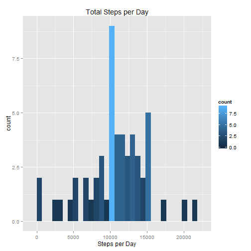
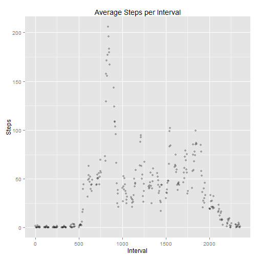
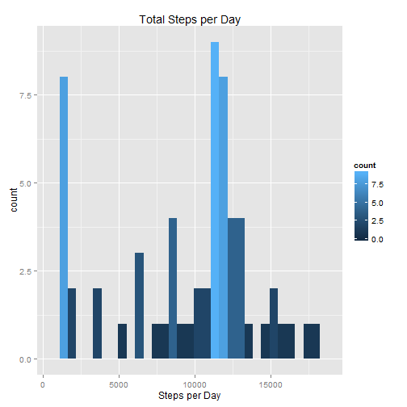
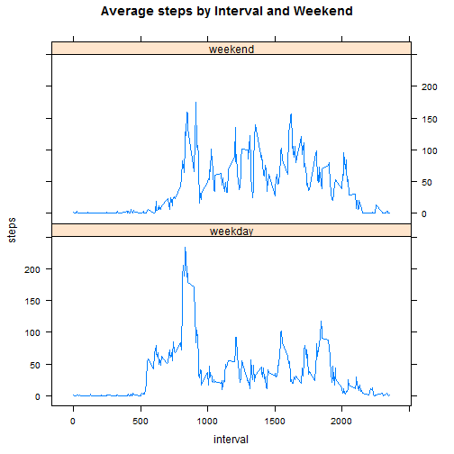

## Loading and preprocessing the data

First we start by downloading the file, unziping it and having a first glance at what the data looks like

(Comment the download so it does not happen everytime)

```r
#download.file("https://d396qusza40orc.cloudfront.net/repdata%2Fdata%2Factivity.zip","repdata-data-activity.zip")
df <- read.csv(unzip("repdata-data-activity.zip"))
```

```
## Warning in unzip("repdata-data-activity.zip"): error 1 in extracting from
## zip file
```

```
## Error in file(file, "rt"): invalid 'description' argument
```

```r
summary(df)
```

```
##      steps                date          interval     
##  Min.   :  0.00   2012-10-01:  288   Min.   :   0.0  
##  1st Qu.:  0.00   2012-10-02:  288   1st Qu.: 588.8  
##  Median :  0.00   2012-10-03:  288   Median :1177.5  
##  Mean   : 37.38   2012-10-04:  288   Mean   :1177.5  
##  3rd Qu.: 12.00   2012-10-05:  288   3rd Qu.:1766.2  
##  Max.   :806.00   2012-10-06:  288   Max.   :2355.0  
##  NA's   :2304     (Other)   :15840
```

## What is mean total number of steps taken per day?

1. Aggregate the date while summing the steps and exluding the NAs.
2. Loading ggplot2 library and plotting the histogram


```r
sums <- with(df,aggregate(steps~date,data=df,sum,na.rm=TRUE))
colnames(sums) <- c("date","stepssum")
library(ggplot2)
p <- qplot(stepssum,data=sums,geom = "histogram",fill = ..count..) +
    ggtitle("Total Steps per Day") +
    xlab("Steps per Day")
print(p)
```

 

3. Calculating the mean and showing the results in the text:

```r
meanx <- mean(sums$stepssum)
medianx <- median(sums$stepssum)
```
The mean is **1.0766189 &times; 10<sup>4</sup>** steps and the median is **10765** steps.

## What is the average daily activity pattern?

1. Creating the average of steps by interval throught all days


```r
average <- aggregate(steps~interval,data=df,mean,na.rm=TRUE)
p <- ggplot(average,aes(x=interval,y=steps)) +
    ggtitle("Average Steps per Interval") +
    geom_point(alpha=.3) +
    ylab("Steps") +
    xlab("Interval")
print(p)
```

 

2. Selecting the interval that has the biggest average of steps, by subsetting the row   which the max of steps
is found using the column $interval


```r
Maxinterval <- average[which.max(average$steps),]$interval
```
The interval that has the greatest number of steps in average is **835**

## Imputing missing values

1. As shown before by the summary, only the steps column has NAs. But to achieve the result, I will sum the logical vector in.na

```r
NAnum <- sum(is.na(df$steps))
```
The number of NAs is **2304**

2. To fill up the NAs I decided to use the average by interval. First I merge both data sets by the interval so that the NAs already have their correct value line by line, but in another column. Then find the rows where there are NAs and assign the values to the NAs.
3. And do all that while creating a data frame that is equal to the original, but with the corrected NAs

```r
df2 <- merge(df, average, by="interval", suffixes=c("",".2"))
nas <- is.na(df$steps)
df2$steps[nas] <- df2$steps.2[nas]
df2 <- df2[,c(1:3)]
```

4. 

```r
sums <- with(df2,aggregate(steps~date,data=df2,sum,na.rm=TRUE))
colnames(sums) <- c("date","stepssum")
library(ggplot2)
p <- qplot(stepssum,data=sums,geom = "histogram",fill = ..count..) +
    ggtitle("Total Steps per Day") +
    xlab("Steps per Day")
print(p)
```

 

```r
meany <- mean(sums$stepssum)
mediany <- median(sums$stepssum)
```
The mean is **9563.9304052** steps and the median is **1.1215679 &times; 10<sup>4</sup>** steps. The diference between the sets without the NAs and with them is **-1202.258274** for the mean and **450.6792453** for the median. Since all NAs are clearly on a single day, it becomes clear that this intervention completely changed the initial result.

## Are there differences in activity patterns between weekdays and weekends?

1. Column created using lubridate's weekdays() than, with ifelse, we apply the desired result
2. Plot created using lattice's xyplot() by weekend


```r
library(lubridate)
library(lattice)
df2$weekday <- weekdays(as.Date(df2$date))
df2$weekend <- ifelse(df2$weekday %in% c("domingo", "sábado"),"weekend", "weekday")
#domingo and sábado are portuguese for Sunday and Saturday
average2 <- aggregate(steps~weekend+interval,data=df2,mean)
xyplot(steps~interval | weekend, data = average2,layout= c(1,2),type="l",main="Average steps by Interval and Weekend")
```

 

Thanks guys.
